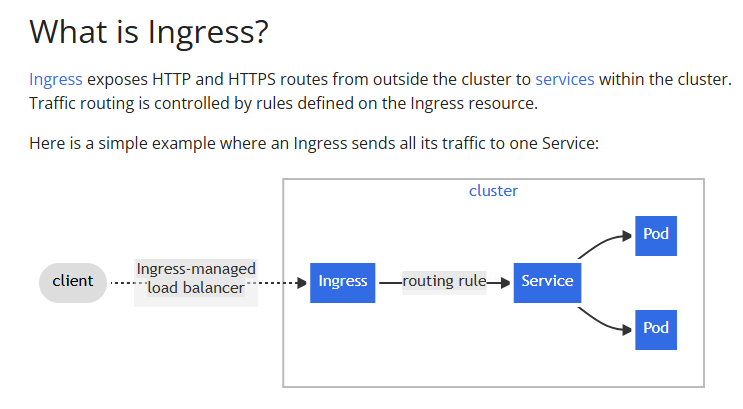

#### In this repo, we will understand how Ingress Controller works

    This is a onetime setup in the applications

    Ingress Controller is nothing but a Application loadbalancer from AWS

    https://kubernetes-sigs.github.io/aws-load-balancer-controller/latest/deploy/installation/

    #### Understanding Ingress Controller in a general context

    Ingress Controller === (AWS Application LoadBalancer)

    ALB Listener --> Rule --> Target Group --> VM
    ALB Listener --> Rule --> Target Group --> Container/Pod

    low resources, fast provisioning, fast scaling

    Service: LoadBalancer --> Classic LoadBalancer (legacy). We can't extend this to multiple applications. It is not intelligent

    We prefer ALB, it is intelligent highly available and scalabe. It can read URL, headers, etc and forward the traffic to different targetgroups

    cart.daws84s.site --> forward to cart targetgroup

    m.facebook.com --> mobile

    icici.com
    netbanking.icici.com --> netbanking targetgroup
    corporatebanking.icici.com --> cb targetgroup

    IAM --> Roles, permissions, etc.
    K8 --> It is independent platform as a service. K8 has its own RBAC. Why should we integrate K8 RBAC and IAM. Because AWS services should have IAM permissions to create/manage other services. to create AWS services from K8 resources K8 SA should integrate with AWS IAM Role.

    Ingress controller --> Ingress

#### Understanding OIDC Provider role in Ingress Controller

    # OIDC === trust and authentication provider

    An OpenID Connect (OIDC) provider, when integrated with an Ingress Controller in Kubernetes, facilitates secure authentication and Single Sign-On (SSO) for applications exposed through the Ingress. The Ingress Controller acts as a relying party, offloading authentication to an external OIDC Identity Provider (IdP) like Okta, Google, or Auth0

    Step-by-Step Understanding about OIDC
    1️⃣ User Tries to Access the App
    You open your browser and visit a URL like https://myapp.company.com. This request goes through the Ingress Controller, which acts like a gatekeeper.

    2️⃣ Ingress Redirects You to Login
    The Ingress Controller sees that you’re not logged in. It redirects you to a login page hosted by an Identity Provider (IdP) like Google, Okta, or Auth0.

    Think of the IdP as the trusted bouncer who checks your ID before letting you into the club.

    3️⃣ You Log In
    You enter your username and password on the IdP’s login page. If everything checks out, the IdP says, “Cool, you’re verified.”

    4️⃣ IdP Sends You Back with a Code
    After logging in, the IdP sends you back to the Ingress Controller with a special code (called an authorization code).

    This code is like a signed note saying, “Yes, this person is legit.”

    5️⃣ Ingress Exchanges the Code for a Token
    The Ingress Controller takes that code and asks the IdP for a token—specifically an ID token that contains your identity info (like your name, email, etc.).

    It’s like trading the signed note for a VIP pass.

    6️⃣ Ingress Lets You In
    Now that the Ingress Controller knows who you are, it lets you access the app. It can even pass your identity info to the app via headers, so the app knows who you are without needing its own login system.

#### Commands to implement Ingress Controller

    These are the variables and we should give them on our worker machine

    REGION_CODE=us-east-1 # replace with your region
    CLUSTER_NAME=roboshop-dev # replace with your cluster name
    ACC_ID=315069654700    # replace with your accountID

    And now Create an IAM OIDC provider

    eksctl utils associate-iam-oidc-provider \
    --region $REGION_CODE \
    --cluster $CLUSTER_NAME \
    --approve

    # Download IAM Policy

    curl -o iam-policy.json https://raw.githubusercontent.com/kubernetes-sigs/aws-load-balancer-controller/v2.13.4/docs/install/iam_policy.json

    # Create an IAM policy named AWSLoadBalancerControllerIAMPolicy. If you downloaded a different policy, replace iam-policy with the name of the policy that you downloaded

        aws iam create-policy \
        --policy-name AWSLoadBalancerControllerIAMPolicy \
        --policy-document file://iam-policy.json

    # Create an IAM role and Kubernetes ServiceAccount for the LBC. Use the ARN from the previous step.
        This is Mapping between IAM ROle and K8 Service account

        eksctl create iamserviceaccount \
        --cluster=$CLUSTER_NAME \
        --namespace=kube-system \
        --name=aws-load-balancer-controller \
        --attach-policy-arn=arn:aws:iam::$ACC_ID:policy/AWSLoadBalancerControllerIAMPolicy \
        --override-existing-serviceaccounts \
        --region $REGION_CODE \
        --approve

#### UNDERSTANDING WHY WE ARE USING THE ABOVE STEPS

    IAM --> has Roles, permissions, etc.
    K8 --> It is independent platform as a service. K8 has its own RBAC. 
    Why should we integrate K8 RBAC and IAM ?
    Because AWS services should have IAM permissions to create/manage other services.To create AWS services from K8 resources K8 SA should integrate with AWS IAM Role.

#### Install Load balancer controller drivers

    helm repo add eks https://aws.github.io/eks-charts

    helm install aws-load-balancer-controller eks/aws-load-balancer-controller -n kube-system --set clusterName=$CLUSTER_NAME --set serviceAccount.create=false --set serviceAccount.name=aws-load-balancer-controller

    The below is the Ingress controller diagram, where TargetGroup has all the pods

#### Understanding Ingress yaml file

    apiVersion: networking.k8s.io/v1
    kind: Ingress
    metadata:
        name: app1
        annotations:
          alb.ingress.kubernetes.io/listen-ports: '[{"HTTPS": 443}]'
          alb.ingress.kubernetes.io/certificate-arn: arn:aws:acm:us-east-1:315069654700:certificate/806e53c3-3894-49ff-96c7-fbd7c3b753ff
          alb.ingress.kubernetes.io/scheme: internet-facing
          alb.ingress.kubernetes.io/target-type: ip
          alb.ingress.kubernetes.io/group.name: joindevops
    spec:
        ingressClassName: alb
        rules:
        - host: "app1.daws84s.site"
          http:
            paths:
            - pathType: Prefix
              path: "/"
              backend:
                service:
                    name: app1
                    port:
                        number: 80 # app1 service port

#### Understanding Ingress Controller
     
     What is Ingress? 
     Ingress exposes HTTP and HTTPS routes from outside the cluster to services within the cluster. Traffic routing is controlled by rules defined on the Ingress resource.
     Here is a simple example where an Ingress sends all its traffic to one Service:
    